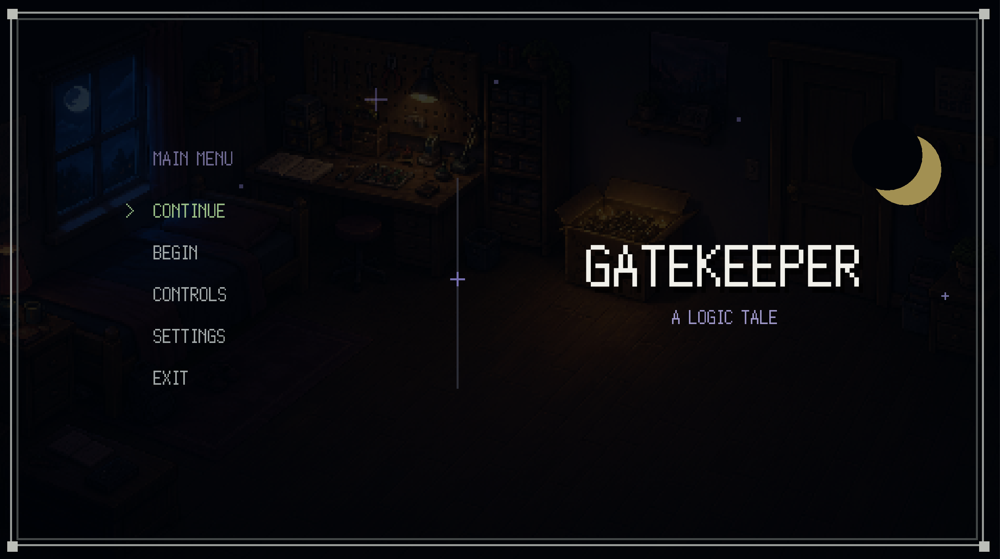

# Gatekeeper

Gatekeeper is a Java 2D story and puzzle game built with Java 17 and Gradle. Featuring low-resolution retro-RPG pixel art presentation, dialogue choices, original environments, and an interactive circuit crafting board where players build logic gates (NAND, NOR, XOR, XNOR, IMPLY) from core components.



## Overview & Gameplay

1. **Explore**: Navigate Alex's bedroom and Lantern Street.
2. **Interact & Craft**: Talk to characters and access the interactive crafting board.
3. **Build Gates**: Construct real logic circuits using AND, OR, and NOT gates.
4. **Test & Progress**: Record truth table outputs manually or with the LogicLens auto-tester to progress through the story.

---

## Controls

* **WASD / Arrow Keys**: Move Alex
* **E / Enter**: Interact / Continue dialogue
* **N**: Toggle Notebook
* **Mouse / 1, 2, 3**: Operate crafting board and place AND, OR, NOT gates
* **A / B**: Toggle board inputs
* **R**: Record truth-table row
* **T / Enter**: Verify circuit / Run tester
* **Esc**: Exit board or notebook
* **F1**: Developer scene menu

---

## How to Run

### Requirements
* Java 17 or higher
* Gradle (or use the included wrapper if present)
* (Optional) [`just`](https://github.com/casey/just) command runner

### Quick Run

Using `just`:
```bash
just run
```

Using Gradle:
```bash
gradle lwjgl3:run --no-daemon --console=plain
```

### Running Tests

Run the test suite with:
```bash
./test.sh
```

or via `just`:
```bash
just test
```
